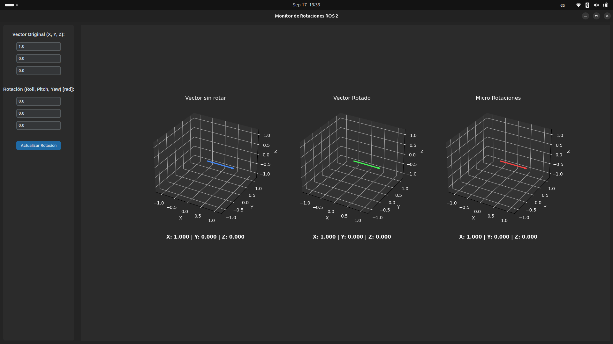

# Micro rotaciones en micro-ROS (ESP32)

Grupo: Francisco Soria, Martin Bravo, Cande Benavides, Dolores Gómez, Tatiana Pagano, Abigail Barbieri

Firmware para ESP32 que recibe un vector (X, Y, Z) y un vector de rotaciones (roll, pitch, yaw)
como valores ingresados por consola y enviados por un agente UDP de microros como topicos de ROS 2
dentro del nodo de microros en el ESP se reciben estos datos, se calcula la rotacion del vector 
usando microrotaciones y se devuelve el vector rotado con un publisher.

## Objetivos

- Implementar un nodo en el ESP32 usando micro-ROS que calcule y publique la rotacion de un vector usando microrotaciones.
- Visualizar y validar los datos de la rotacion calculada usando un nodo de ros2 con una interfaz en matplotlib que muestre en tres plots distintos el grafico del vector sin rotar, grafico del vector microrotado y grafico del vector rotado con calculo convencional.

## Hardware

- ESP32 DevKit (30 pines).
- Red WiFi compartida entre el ESP32 y la PC que corre el Agent.


## Estructura del proyecto

```
potenciometro/
├── main/
│   ├── rotaciones_microros_main.c   # firmware: nodo micro-ROS
│   └── CMakeLists.txt
├── components/
│   └── micro_ros_espidf_component/   # componente micro-ROS 
├── pc_tools/
│   └── rotaciones_monitor.py        # monitor de PC: envia datos y muestra graficos
└── docs/img/                     # capturas y fotos del armado
```

## Tópicos publicados

| Tópico       | Tipo                 | Descripción                        |
| ------------- | -------------------- | ----------------------------------- |
| `/vector`     |   | Un vector con componentes en x, y , z       |
| `/euler`      |  | Un vector de angulos con rotaciones roll, pitch, yaw |
| `/vector_rotado`     |   | El vector micro-rotado con componentes en x, y , z       |

## Cómo compilar y flashear

```bash
# solo la primera vez si no esta instalado el componente de microros
mkdir components
cd components
git clone -b jazzy https://github.com/micro-ROS/micro_ros_espidf_component.git
```

```bash
cd micro_rotaciones
. $IDF_PATH/export.sh
idf.py menuconfig   # micro-ROS Settings: Agent IP/Port, WiFi SSID/Password
idf.py build
idf.py flash monitor
```

## Cómo levantar el micro-ROS Agent

En otra terminal (esta sí con ROS2 sourceado):

```bash
cd ~/micro_ws
source install/setup.bash
ros2 run micro_ros_agent micro_ros_agent udp4 --port 8888
```

Verificación:

```bash
ros2 topic list
ros2 topic echo /vector
ros2 topic echo /euler
ros2 topic echo /vector_rotado
```

## Visualización y log de datos

```bash
cd pc_tools
python3 rotaciones_monitor.py
```


